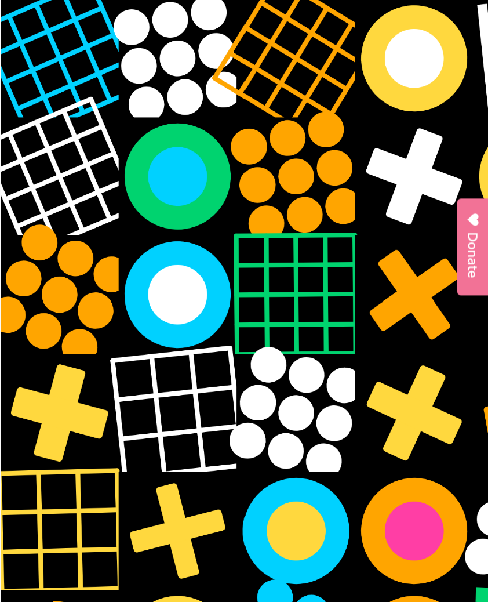

Geometric Mosaic Playground

A bold and playful composition made with p5.js, combining grids, circles, and crosses in a dynamic layout.
This project explores generative geometry, color balance, and random composition, inspired by modern graphic design and Bauhaus aesthetics.

🔗 [Mosaic preview](https://p5js-mosaic.netlify.app)

✨ Features

Procedural generation of geometric shapes

Randomized rotation, color, and placement

High-contrast visual rhythm with minimal shapes

🧠 Concept
An exploration of structure and spontaneity — where grids, circles, and crosses coexist in organized chaos.

🛠️ Built with
p5.js · JavaScript · Creative Coding
